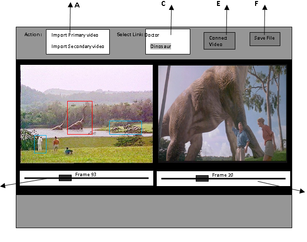
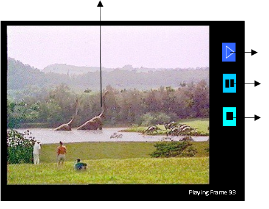
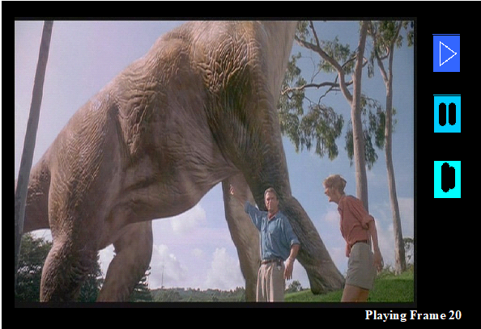

**Hypermedia – Creation and Consumption**

**Description:** One of the necessary properties of digital multimedia
content is that it needs to be interactive. Interactive Multimedia
Content is available in different forms today. We only text is involved,
we are all familiar with hyper linked text documents and the http
protocol enabling browsing of text in a non linear manner. The same
metaphor can be extended to create hyper linked images, video and media.
In particular, this project will allow you to explore the creation and
consumption of interactive video - Hypervideo, or Hyperlinked video.
Hypervideo video is a displayed video stream that contains embedded,
user-clickable anchors allowing navigation between video and other
hypermedia elements. Hypervideo is thus analogous to hypertext, where a
reader clicks on a word in one document to retrieve information from
another document, or from another place in the same document. Hypervideo
thus combines video with a non-linear information structure, allowing a
user to make choices based on the content of the video and the user's
interests. The defining difference between hypervideo and hypertext is
the element of time. Text is static, while a video is necessarily
dynamic; the content of the video changes with time. Consequently,
hypervideo has different technical and aesthetic requirements. For
example, hypervideo might involve the creation of a link from an object
in a video that is visible for only certain duration. It is therefore
necessary to segment the video spatially and temporarily appropriately
and add the metadata required to link a defined region in the video to
other media elements. Also the behavior of interactivity could also be
different – you could browse to another media element, or have a pop up
widget that shows linked information. Another difficulty is that
automatically segmenting video of all kinds is not easy and as yet, an
area of research in computer vision. In this project you will explore
the problem space of hypervideo. Consequently, you have two tasks: 
  * Create an authoring tool to setup hyper linked videos 
  * Create an interactive video player to interact with hypervideos. Both of these are
explained in detail below with example user interfaces/workflows.

However, the implementation that your group designs will be specific to
your skill sets and efforts. Remember, there will definitely be no wrong
answer or wrong implementation and you are not even asked to follow
strict guidelines, but your tools will be measured by how easy it is to
create interactive hypervideo content and how seamlessly and quickly you
can navigate the content in your player. This will depend on your
design, architecture and workflow principles. So give it a respectful
thought!

Part 1: Create a Hyper-Linking Video Tool. Here you will write an
application that needs to load videos and setup hyperlinks. Your
authoring tool should have the following capabilities: 
1. Import video(s). There should be a minimum of two videos that can be imported
in your interface – one primary video that you are creating hyperlinks
for and the other secondary video which helps set up your hyperlink
target. The latter is more to help you visually see your hyperlink
target and the frame number to link to. 
2. Navigate through all frames of the video a timeline with a slider (or something similar). This
should allow random access to any frame 
3. Define and edit areas to track in the main video and setup up hyperlinks for this tracked area.
Tracking areas represent semantic regions of interest, which could be
automatically detected in future by advance vision algorithms, but for
now we will resort to manually defining these areas in your setup. 
   * Use bounding boxes to setup an area of interest on a frame. The area of
interest could be visible for a short (or long) time segment in the
video. 
   * They could change position and shape while they are defined,
mostly to follow the object of interest. 
   * For each area, you should be able to setup a hyperlink pointer to point to a video with a frame
number. This hyper link specifies how your video will change and jump to
a new video when interactively viewing in your player. 
4. On conclusion of your authoring session, your setup should have a save data button,
that will save a metadata file which encapsulates all the setup
hyperlink information for the current primary video. You may choose your
own design/format for this file. Here is a simple, but functional setup
for such an authoring tool. You are free to design your own. The menus
and options suggest possible functionalities that your setup should
provide in order to create hyper linked videos. While user interface
design is not something that will decide your grade, do give it ample
thought so as to make easy workflow metaphors to create hyperlinked
videos.

In the above figure 
A) Shows you the actions to perform. 
    * Import video – loads the primary video on the left. 
    * Import link video – loads the secondary video to the right, you may load secondary videos multiple
    times in session because different links may need different videos. 
    * Create new hyperlink – creates a new link with an editable name, centers
    a default bounding box (which you may edit) and adds it to a list of
    links which are displayed in C 
B) Slider to move across frames for
primary video 
C) Shows you a list of links that you might have created
during a session. You could have their names editable so you can name
them contextually. Selecting a link should highlight the link selected
(in say red) and also move the primary video to the first frame where it
is setup. 
D) Slider to move across frames for linked video 
E) Define Link – defines the hyper link for the selected item to the video frame
of the video currently in D. Note – you should be able to load any
secondary video on the right during a session to define your links. For
example, you might create a link, edit it to fit to an area and then load a video on the right
which you think you want to link to, and may have to visualize several
before you choose the right one. 
F) Save file – This will create an auxiliary meta data file, of the same base name as the primary video
that contains all the hyperlinks. Note you may define what this file
format should be as mentioned earlier, but make sure you save the
necessary information required for your hyperlinked video to play
correctly in your player.

Part 2: Interactive video player. Your player should load the specified
video and its corresponding meta data file. You should be able to play
the video and audio at frame rate. Below is a simple interface for a
player – you have a video playing at frame rate with a play, pause and
stop button (A, B and C respectively). 

You also need to respect the hyperlinks that were defined in your setup
session while creating hyperlinks. So for instance, if you clicked on D
while the video is playing, you should stop the current video and load
the corresponding video to play it from the frame defined during the
setup phase.

